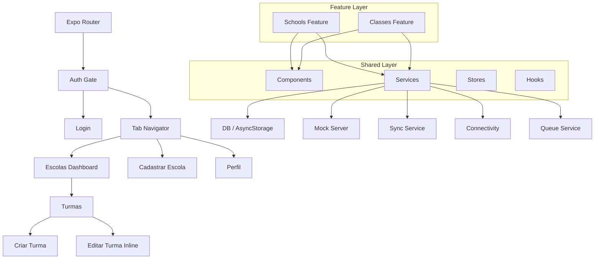
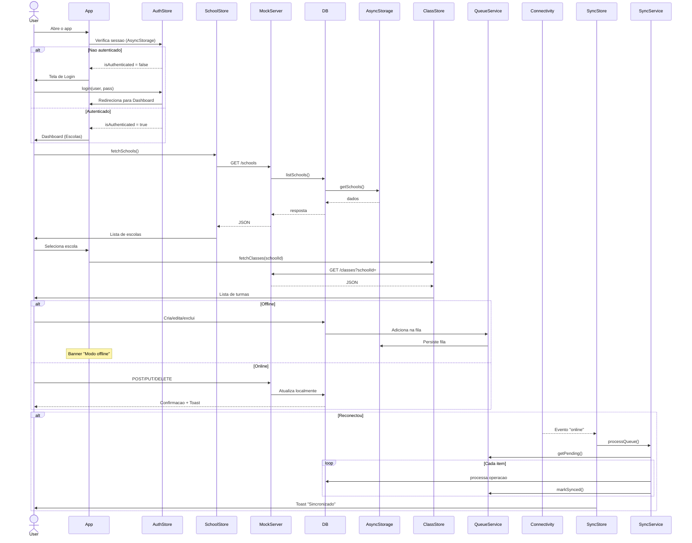

# Gestao Escolar

[](https://www.typescriptlang.org/)
[](https://reactnative.dev/)
[](https://expo.dev/)
[](.)
[](.)
[](./LICENSE)

Aplicacao mobile multiplataforma para **gestao de escolas publicas e turmas**, desenvolvida como desafio tecnico utilizando Expo, React Native e TypeScript com arquitetura corporativa.

> **Login:** qualquer usuario e senha nao vazios sao aceitos
> **Tempo para testar:** menos de 2 minutos

---

## Demonstracao

| Web | APK |
|---|---|
| [cristianokituxi.github.io/teste-prover](https://cristianokituxi.github.io/teste-prover/) | Disponivel via [EAS Build](https://expo.dev/accounts/ckituxi/projects/testeprover/builds/) |

### Screenshots

| Login | Dashboard | Turmas |
|:---:|:---:|:---:|
|  |  |  |

| Cadastro Escola | Editar Escola | Escluir escola | Turma
|:---:|:---:|:---:|

---

## Objetivo

Aplicacao desenvolvida como **desafio tecnico** para demonstrar competencia em arquitetura mobile moderna, offline-first e boas praticas de engenharia de software. Permite que gestores escolares cadastrem, consultem, editem e excluam escolas e turmas, com busca em tempo real, dashboard de metricas e funcionamento offline.

---

## Funcionalidades

### Autenticacao

- Login demonstrativo: qualquer usuario e senha nao vazios
- Sessao persistida com Zustand + AsyncStorage
- Redirecionamento automatico entre rotas publicas e privadas

### Escolas

- Listagem com pull-to-refresh
- Busca em tempo real por nome ou endereco
- Filtros rapidos: Todas / Com turmas / Sem turmas
- Cadastro com preview em tempo real
- Edicao com formulario dedicado
- Exclusao com modal de confirmacao
- Metricas: total de escolas e turmas

### Turmas

- Listagem vinculada a escola com banner visual
- Busca por nome ou turno
- Cadastro com selecao ciclica de turno (Manha/Tarde/Noite)
- Edicao inline com formulario expansivel
- Exclusao com modal de confirmacao
- Metricas: total de turmas, diversidade de turnos
- Acoes da escola: editar/excluir no header da tela de turmas

### Offline First

- Persistencia local via AsyncStorage com seed data (2 escolas, 3 turmas)
- Fila de operacoes pendentes (`queueService`) para sincronizacao posterior
- Deteccao de conectividade com fallback para eventos nativos do browser
- Sincronizacao simulada ao recuperar conexao (latencia de 600ms por item)
- Banner indicador de status offline/sincronizando

### UX/UI

- Dashboard com metricas na tela inicial
- Skeleton loading durante carregamento
- Pull-to-refresh em todas as listagens
- Empty state ilustrado com CTA
- Toast notifications animados (success/error/info)
- Modal de confirmacao para exclusoes
- Estados de Loading, Error e Empty tratados em todas as telas
- Preview em tempo real nos formularios
- Design System com tokens centralizados (Gluestack UI)

---

## Tecnologias

| Categoria | Tecnologia | Finalidade |
|---|---|---|
| Framework | React Native `0.83` + Expo SDK `55` | Execucao multiplataforma |
| Linguagem | TypeScript `5.9` (strict mode) | Seguranca de tipos |
| Roteamento | Expo Router (file-based) | Navegacao declarativa |
| UI | Gluestack UI | Design system e componentes |
| Estado global | Zustand `5.x` | Gerenciamento de estado |
| Persistencia | AsyncStorage | Dados locais offline |
| Formularios | React Hook Form `7.x` + Zod `3.x` | Validacao type-safe |
| HTTP | Axios `1.x` | Cliente HTTP com interceptors |
| Mock API | Custom fetch interceptor + MSW `2.x` (handlers) | Simulacao de backend |
| Testes | Jest `29.x` + react-test-renderer `19.x` | Testes unitarios e de componente |
| Qualidade | ESLint `8.x` + Prettier `3.x` + Husky `9.x` + lint-staged | Padronizacao de codigo |
| CI/CD | GitHub Actions | Pipeline de qualidade, deploy web e build APK |
| Build | EAS Build | Build de binarios nativos |

---

## Arquitetura

### Diagrama



### Feature First

O codigo e organizado por **dominio** e nao por camada tecnica. Cada feature (`schools`, `classes`) contem todos os artefatos necessarios para funcionar de forma independente:

```
src/features/schools/
  components/   # SchoolCard
  hooks/        # useSchools, useCreateSchool...
  repository/   # SchoolRepository (Axios)
  store/        # useSchoolStore (Zustand)
  types/        # School, SchoolInput, Shift
  validation/   # schoolSchema (Zod)
```

Isso facilita navegacao, testes isolados e extracao para pacotes independentes no futuro.

### Repository Pattern

Cada feature possui um **Repository** que abstrai a camada de dados. Os repositories utilizam Axios para comunicacao HTTP, permitindo trocar o backend (mock → API real) sem alterar stores ou componentes.

### Zustand

Gerenciamento de estado com API minimalista. As stores (`useSchoolStore`, `useClassStore`, `useAuthStore`, `useSyncStore`, `useToastStore`) gerenciam dados, loading, erros e efeitos colaterais. O `useAuthStore` utiliza o middleware `persist` com AsyncStorage.

### Mock Server

O mock de API intercepta `global.fetch` e roteia requisicoes para o banco local (`db.ts`), que opera sobre AsyncStorage. Suporta todos os verbos HTTP com respostas realistas (201, 204, 400, 404) simulando latencia de rede. Handlers MSW pre-escritos permitem migracao futura para MSW runtime.

### Expo Router

Roteamento baseado em arquivos com suporte a:
- Grupos de rotas (`(auth)`, `(tabs)`)
- Parametros dinamicos (`[schoolId]`)
- Layouts aninhados (`_layout.tsx`)
- Redirecionamentos declarativos

---

## Fluxo da Aplicacao



---

## Offline First

O app foi projetado para funcionar **sem conexao com internet**, com sincronizacao transparente quando a rede voltar.

### Camadas

| Camada | Responsabilidade | Arquivo |
|---|---|---|
| **DB** | CRUD local com AsyncStorage + seed data | `db.ts` |
| **Storage** | Persistencia chave-valor com seed inicial | `storageService.ts` |
| **Queue** | Fila de operacoes pendentes (create/update/delete) | `queueService.ts` |
| **Sync** | Processamento da fila com latencia simulada (600ms) | `syncService.ts` |
| **Connectivity** | Deteccao de status online/offline | `connectivityService.ts` |
| **SyncStore** | Orquestracao: detecta conexao → dispara sync | `useSyncStore.ts` |

### Comportamento

1. **Sempre online (padrao)**: operacoes persistem localmente e nao geram fila
2. **Offline**: cada mutacao gera um item na fila (`QueueService`) com status `pending`
3. **Reconexao**: `SyncService` processa a fila item por item, atualizando dados locais
4. **Banner**: componente `OfflineBanner` indica estado atual (offline/sincronizando)

> A sincronizacao e **simulada** — implementada para demonstrar o comportamento de uma futura API real. Em producao, o `SyncService` enviaria as operacoes para o backend.

---

## Estrutura de Pastas

```
.
├── app/                              # Rotas (Expo Router file-based)
│   ├── _layout.tsx                   # Root layout: auth gate + providers
│   ├── index.tsx                     # Redireciona para /login
│   ├── (auth)/login.tsx              # Tela de login
│   ├── (tabs)/_layout.tsx            # Tab navigator (Escolas/Cadastrar/Conta)
│   ├── (tabs)/profile.tsx            # Tela de perfil e logout
│   └── (tabs)/schools/
│       ├── list.tsx                  # Dashboard com cards de escolas
│       ├── create.tsx                # Formulario de nova escola
│       └── [schoolId]/
│           ├── edit.tsx              # Editar dados da escola
│           ├── classes.tsx           # Turmas com edicao inline
│           └── classes-create.tsx    # Criar nova turma
│
├── src/
│   ├── features/                     # Codigo organizado por dominio
│   │   ├── schools/                  # Feature: Escolas
│   │   │   ├── components/           # SchoolCard
│   │   │   ├── hooks/                # useSchools, useCreateSchool, useDeleteSchool
│   │   │   ├── repository/           # SchoolRepository (Axios → API)
│   │   │   ├── store/                # useSchoolStore (Zustand)
│   │   │   ├── types/                # Tipos e enumeracoes (School, Shift)
│   │   │   └── validation/           # schoolSchema (Zod)
│   │   └── classes/                  # Feature: Turmas
│   │       ├── components/           # ClassCard
│   │       ├── hooks/                # useClasses, useCreateClass, useDeleteClass
│   │       ├── repository/           # ClassRepository (Axios → API)
│   │       ├── store/                # useClassStore (Zustand)
│   │       ├── types/                # Tipos (SchoolClass)
│   │       └── validation/           # classSchema (Zod)
│   │
│   └── shared/                       # Codigo compartilhado entre features
│       ├── components/               # 11 componentes reutilizaveis
│       │   ├── DecorativeHero        # Header estilizado (usado no login/forms)
│       │   ├── EmptyState            # Estado vazio com icone e CTA
│       │   ├── FormField             # Campo de formulario com erro integrado
│       │   ├── Loading               # Indicador de carregamento + Skeleton
│       │   ├── MetricCard            # Card de metrica (dashboard)
│       │   ├── ModalDelete           # Modal de confirmacao de exclusao
│       │   ├── OfflineBanner         # Banner offline/sincronizando
│       │   ├── ScreenContainer       # Container padrao de tela
│       │   ├── SearchBar             # Barra de busca com clear
│       │   ├── SyncStatusBadge       # Badge de status da sincronizacao
│       │   └── ToastContainer        # Container de toasts animados
│       ├── hooks/
│       │   ├── useConnectivity       # Hook de status de rede
│       │   └── useSync               # Hook de controle de sincronizacao
│       ├── services/
│       │   ├── apiClient             # Instancia Axios configurada
│       │   ├── connectivityService   # Deteccao de rede (NetInfo + browser)
│       │   ├── db                    # Camada de banco local (AsyncStorage)
│       │   ├── mockHandlers          # Handlers MSW (preparados para migracao)
│       │   ├── mockServer            # Mock via interceptacao de fetch
│       │   ├── queueService          # Fila de operacoes offline
│       │   ├── storageService        # Persistencia com seed data
│       │   └── syncService           # Processador da fila de sync
│       ├── store/
│       │   ├── useAuthStore          # Estado de autenticacao (persist)
│       │   ├── useSyncStore          # Estado de sincronizacao
│       │   └── useToastStore         # Estado dos toasts
│       ├── theme/
│       │   └── tokens                # Design tokens centralizados
│       └── utils/
│           └── errors                # AppError e mensagens amigaveis
│
├── __tests__/                        # Testes unitarios (Jest)
│   ├── repositories/                 # db.test.ts
│   ├── stores/                       # schoolStore, classStore, toastStore
│   ├── utils/                        # errors.test.ts
│   └── validations/                  # schemas.test.ts
│
├── assets/                           # Icones, splash e screenshots
├── .github/workflows/                # CI/CD pipelines
│   ├── ci.yml                        # Typecheck + Lint + Testes
│   ├── deploy-web.yml                # Deploy GitHub Pages
│   └── build-apk.yml                 # Build APK via EAS
├── app.json                          # Configuracao Expo
├── eas.json                          # Perfis EAS Build
├── tsconfig.json                     # TypeScript strict
├── jest.config.js                    # Configuracao Jest
└── package.json                      # Dependencias e scripts
```

---

## Decisoes Tecnicas

| Decisao | Justificativa |
|---|---|
| **Expo Router** | Roteamento file-based com layouts aninhados, groups e redirecionamento. Substitui React Navigation com menos boilerplate. |
| **Zustand** sobre Redux | API minimalista (~10 linhas por store), persistencia nativa, sem providers ou actions/types redundantes. |
| **Gluestack UI** | Design system unificado com tokens de cor, espacamento e tipografia. Componentes acessiveis e temas prontos. |
| **Feature First** | Agrupa codigo por dominio e nao por camada. Facilita navegacao, testes isolados e extracao futura para micro-frontends. |
| **Repository Pattern** | Desacopla stores da camada HTTP. Trocar mock por API real requer apenas alterar o baseURL do Axios. |
| **Mock Server customizado** | Intercepta `global.fetch` sem depender de Service Worker (compativel com React Native e testes). Handlers MSW prontos para migracao futura. |
| **Offline First** | Dados sempre disponiveis localmente. Fila de operacoes permite uso continuo sem internet, com sync automatico ao reconectar. |
| **React Hook Form + Zod** | Formularios com zero re-renderizacoes desnecessarias. Validacao type-safe com mensagens em portugues. |

---

## Trade-offs

| Escolha | Contexto |
|---|---|
| **Mock server customizado** em vez de backend real | Desafio tecnico sem dependencia de infraestrutura externa. Pronto para migrar para API REST. |
| **Autenticacao demonstrativa** | Foco na arquitetura e funcionalidades de negocio. JWT pode ser adicionado sem alterar stores. |
| **Sincronizacao simulada** | Demonstra o fluxo offline-first completo (fila, retry, status). Trocar `SyncService` por chamadas HTTP reais e suficiente. |
| **AsyncStorage** em vez de SQLite/WatermelonDB | Dados simples (2 entidades, relacionamento 1:N). AsyncStorage e suficiente e evita complexidade de schema migrations. |
| **Dados em memoria** (mock reseta ao recarregar) | Aceitavel para demo/POC. Seed data garante estado inicial consistente. |

---

## Como Executar

### Pre-requisitos

- Node.js `>= 20`
- npm `>= 10`

### Instalacao

```bash
git clone https://github.com/cristianokituxi/teste-prover.git
cd teste-prover
npm install --legacy-peer-deps
```

### Android

```bash
npx expo start --android
```

### iOS

```bash
npx expo start --ios
```

### Web

```bash
npx expo start --web
```

### Testes

```bash
npm test              # 76 testes em 19 suites
npm run test:watch    # Modo watch
npm run test:coverage # Com cobertura
```

### Qualidade de Codigo

```bash
npm run typecheck     # TypeScript strict
npm run lint          # ESLint
npm run lint:fix      # Corrigir lint
npm run format        # Prettier format
npm run format:check  # Verificar formatacao
```

### Build APK (EAS)

```bash
eas login
eas build --platform android --profile preview
```

Perfis disponiveis:

| Perfil | Tipo | Uso |
|---|---|---|
| `development` | APK debug | Dev Client |
| `preview` | APK assinado | Testes internos |
| `production` | AAB | Play Store |

---

## Qualidade

| Ferramenta | Proposito |
|---|---|
| **TypeScript strict** | `strict: true` no `tsconfig.json`. Zero `any` nao intencional. |
| **Jest + react-test-renderer** | 76 testes unitarios: 13 componentes, stores, validacoes, DB e erros. |
| **ESLint** | Regras para React, React Hooks e TypeScript. |
| **Prettier** | Formatacao consistente. |
| **Husky + lint-staged** | Pre-commit hook: lint e format automaticos. |
| **CI/CD** | GitHub Actions: typecheck + lint + testes em todo push e PR. |
| **Conventional Commits** | Mensagens padronizadas (`feat:`, `fix:`, `chore:`, `ci:`, `docs:`). |

---

## CI/CD

### Pipeline de Qualidade (`ci.yml`)

Dispara em push e pull request nas branches `main` e `develop`:

- `npm run typecheck`
- `npm run lint`
- `npm run format:check`
- `npm test`

### Deploy Web (`deploy-web.yml`)

Dispara em push na `main`:

- `expo export --platform web` com `experiments.baseUrl`
- Injeta `type="module"` e fallback SPA (`404.html`)
- Deploy automatico na branch `gh-pages` → GitHub Pages

### Build APK (`build-apk.yml`)

Dispara em push na `main` ou manualmente via `workflow_dispatch`:

- Build APK preview via EAS
- Requer secret `EXPO_TOKEN` configurado no repositorio

---

## Roadmap

- [ ] Migracao para API REST real (substituindo mock server)
- [ ] Autenticacao JWT com refresh token
- [ ] Sincronizacao bidirecional com resolucao de conflitos
- [ ] Push notifications para novas turmas
- [ ] Relatorios e exportacao de dados
- [ ] Dashboard administrativo com graficos
- [ ] Testes E2E com Detox ou Maestro
- [ ] Dark mode
- [ ] Internacionalizacao (i18n)
- [ ] Publicacao na Play Store e App Store

---

## Licenca

MIT © 2026 — [LICENSE](./LICENSE)

---

## Contribuindo

Veja [CONTRIBUTING.md](./CONTRIBUTING.md) para diretrizes de contribuicao.
